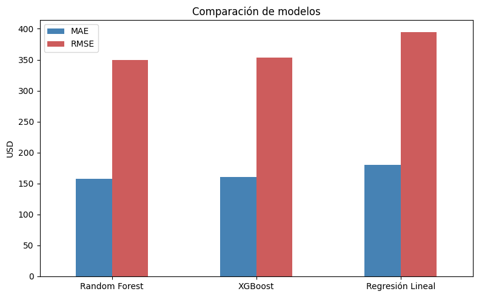
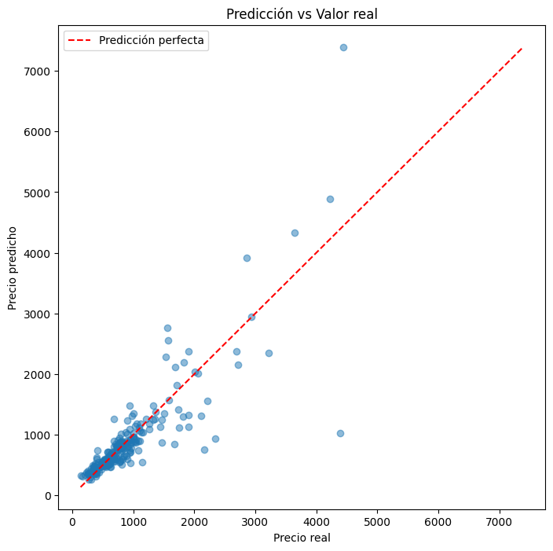
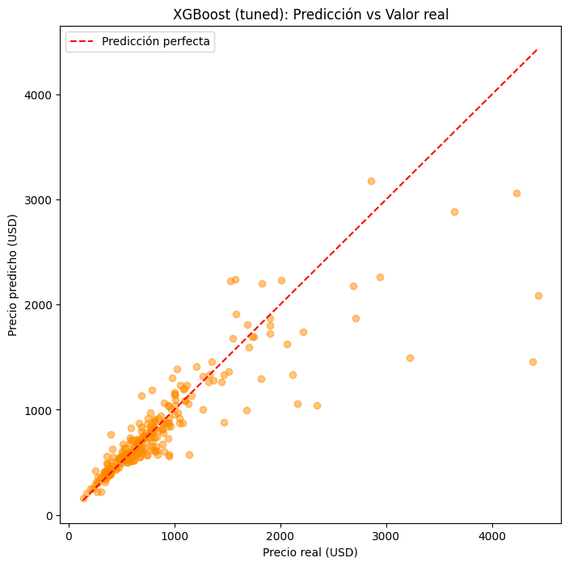
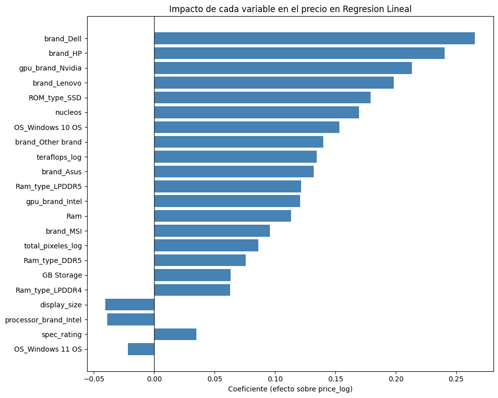
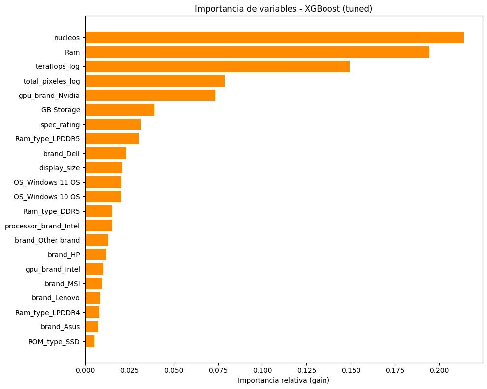

# Predicción del Precio de Laptops mediante Regresión Lineal

Proyecto de ciencia de datos que predice el precio de una laptop a partir de sus especificaciones
técnicas (procesador, RAM, almacenamiento, GPU, pantalla, sistema operativo), usando un modelo
interpretable de regresión lineal y comparándolo contra modelos más flexibles (Random Forest,
XGBoost).

## Problema de negocio

El mercado de laptops ofrece cientos de combinaciones de marca, procesador, RAM, almacenamiento y
tarjeta gráfica, y el precio de cada configuración no siempre es transparente ni consistente entre
marcas. Predecir el precio a partir de las especificaciones es útil para:

- **Retailers/e-commerce:** fijar precios competitivos para un modelo nuevo antes de tener
  historial de ventas, o detectar productos mal cotizados.
- **Consumidores:** responder "¿esta laptop está bien cotizada para lo que trae?".
- **Analistas de producto:** identificar qué componentes explican mejor las diferencias de precio.

El objetivo se abordó primero con un modelo **interpretable** (regresión lineal, para poder
explicar *por qué* predice ese precio) y luego se evaluó cuánta precisión se gana o se pierde al
optar por modelos más flexibles.

## Dataset

Especificaciones y precios de laptops del mercado indio (precio original en rupias, convertido a
USD en el notebook). 830 laptops tras la limpieza, ~14 variables predictoras.

> Agrega aquí el link a la fuente original del dataset (por ejemplo, el dataset de Kaggle del que
> partiste) — no se incluye el CSV crudo en este repo por posibles restricciones de licencia del
> dataset original (ver `.gitignore`).

## Estructura del repositorio

```
.
├── README.md
├── requirements.txt
├── LICENSE
├── .gitignore
├── Prediccion_Precio_Laptops_Regresion_Lineal.ipynb
└── images/
    ├── heatmap_correlacion_final.png
    ├── prediccion_vs_real_regresion_lineal.png
    ├── coeficientes_regresion_lineal.png
    ├── comparacion_modelos.png
    ├── prediccion_vs_real_xgboost_tuned.png
    └── importancia_variables_xgboost.png
```

## Metodología

1. **Limpieza de datos:** estandarización de categorías inconsistentes (sistema operativo, tipo de
   RAM, marca, tamaño de pantalla), eliminación de columnas irrelevantes (`name`, `warranty`).
2. **Ingeniería de variables:** extracción de la marca del procesador y número de núcleos desde
   texto libre; limpieza y mapeo de más de 40 modelos de GPU a su rendimiento estimado en TFLOPS;
   combinación de resolución de pantalla en una sola variable (`total_pixeles`).
3. **Prevención de *data leakage*:** se descartó una variable de "gama de procesador" construida a
   partir del precio histórico promedio, por contaminar el modelo con información de la variable
   respuesta.
4. **Transformaciones estadísticas:** `log1p` sobre variables sesgadas (precio, TFLOPS) para
   acercarse a los supuestos de linealidad, homocedasticidad y normalidad de residuos.
5. **Modelado:** división train/test (70/30) **antes** de escalar (`StandardScaler`) y codificar
   variables categóricas (`get_dummies` + alineación de columnas), para evitar fuga de información
   del conjunto de prueba hacia el entrenamiento.
6. **Comparación de modelos:** Regresión Lineal vs. Random Forest vs. XGBoost, con afinado de
   hiperparámetros de XGBoost vía `GridSearchCV` (5-fold, optimizando RMSE en dólares reales).

El notebook completo, con la narrativa de cada decisión, está en
[`Prediccion_Precio_Laptops_Regresion_Lineal.ipynb`](Prediccion_Precio_Laptops_Regresion_Lineal.ipynb).

## Resultados

Métricas sobre el conjunto de prueba, en dólares reales (revertiendo la transformación logarítmica
del precio):

| Modelo | MAE | RMSE | MAPE |
|---|---|---|---|
| **XGBoost (afinado con GridSearchCV)** | **$156.02** | **$348.49** | **14.53%** |
| Random Forest | $157.60 | $349.84 | 15.33% |
| XGBoost (sin afinar) | $160.09 | $353.94 | 16.22% |
| Regresión Lineal | $180.39 | $394.64 | 18.14% |



Pasar de un modelo lineal a modelos de árboles reduce el error (RMSE) en ~11-12%; afinar
hiperparámetros aporta una mejora adicional pequeña. La diferencia moderada sugiere que la
regresión lineal, con el trabajo de limpieza y transformación de este proyecto, ya captura buena
parte de la señal predictiva disponible.

### Predicho vs. real (Regresión Lineal)



### Predicho vs. real (XGBoost afinado)



### ¿Qué variables explican más el precio?

La regresión lineal y XGBoost no están del todo de acuerdo:





La regresión lineal le da más peso a la **marca** (Dell, HP, Lenovo) y a tener GPU Nvidia, mientras
que XGBoost prioriza especificaciones técnicas puras (núcleos, RAM, TFLOPS de GPU). Ambos modelos
coinciden en la importancia de la GPU Nvidia. Esta discrepancia es en sí misma uno de los hallazgos
más interesantes del proyecto — ver la sección de conclusiones del notebook para más detalle.

## Cómo ejecutarlo

```bash
git clone <url-de-tu-repo>
cd <carpeta-del-repo>
pip install -r requirements.txt
jupyter notebook Prediccion_Precio_Laptops_Regresion_Lineal.ipynb
```

Antes de correr el notebook de punta a punta, ajusta la ruta de `pd.read_csv(...)` en la primera
celda de carga de datos a la ubicación de tu propio `data.csv`.

## Limitaciones y próximos pasos

- El dataset proviene del mercado indio; el modelo puede no generalizar directamente a otros
  mercados sin recalibrar.
- La comparación final de modelos usa un único split de prueba (más allá de la validación cruzada
  usada solo para afinar XGBoost); extender la validación cruzada a los tres modelos daría una
  estimación más estable.
- La importancia de variables de XGBoost no indica dirección del efecto — valdría la pena explorar
  **SHAP values** para reconciliar la discrepancia entre marca (regresión lineal) y
  especificaciones técnicas (XGBoost) como factores dominantes.
- Calcular el **VIF** (Variance Inflation Factor) de cada predictor de la regresión lineal para
  confirmar que la multicolinealidad quedó bajo control más allá del mapa de calor visual.

## Autor

**Diego Monegro**
